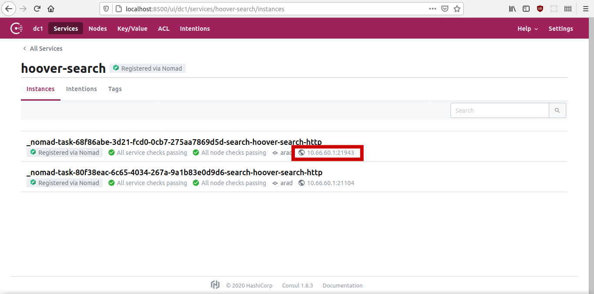

# Development of Hoover UI

It is recommended that you develop hoover-ui locally. There are 2 ways you can develop it locally.

## 1. The hacky way with port forwarding (no login)
You must have access to a server that runs node in a Nomad cluster.

Set the collections you need public, so they can be accessed without a user login.
Get the port of the Consul hoover-search service. You can do this through the Consul UI:
  
In this case, the port is 21943.
  
Make a port forwarding to that port to localhost:5000 (or whaterver you want):
```
  $ ssh -L 5000:10.66.60.1:21943 <user>@<server_hostname>
```
Alternatively, you can do this in your ~/.ssh/config:
```
Host liquid-server 
    HostName <server_hostname>
    User <user>
    LocalForward 5000 10.66.60.1:21943
```
And login to your server with:
```
  $ ssh liquid-server
```
On your machine, set up /etc/hosts with the url to hoover:
/etc/hosts
```
...
127.0.0.1 hoover.liquid.example.org
...
```
In the hoover-ui directory, do this:
```
  $ export HOOVER_REMOTE_SEARCH_URL=http://hoover.harghita.alt-f4.ro:5000/
  $ npm run dev
```

You can now access your UI on http://localhost:3000

## 2. The proxy way (requires login cookie)
  The instructions are here: https://github.com/liquidinvestigations/hoover-ui-proxy
  
# Deployment to node
In order for hoover-ui to be deployed and run into node, it has to be uploaded to dockerhub. This is done autmoatically by drone when you push your branch on liquidinvestigations/hoover-ui.
In /opt/node/versions.ini, you should change the hoover-ui url, to the one on dockerhub, corresponding to the branch.

