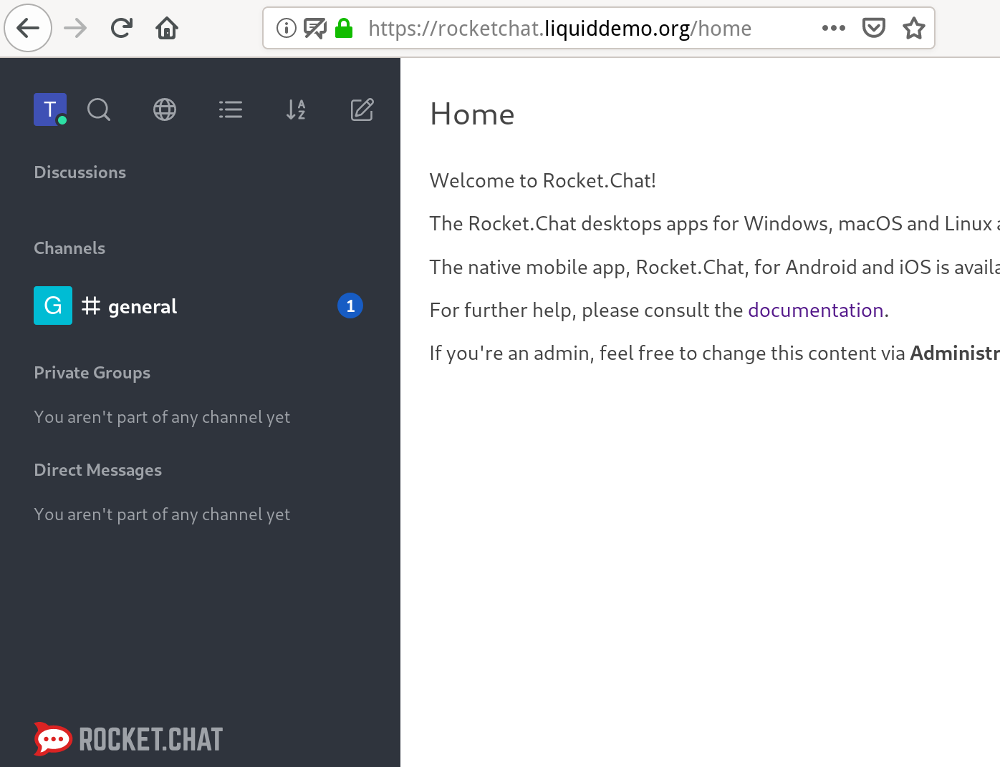

# RocketChat

RocketChat provides a chat service and is hosted at
`rocketchat.<liquid_domain>`. It requires manual configuration to let users log
in with accounts from `liquid-core`, see the steps below.


## Set up authentication

Rocket.Chat can directly authenticate users with the `liquid-core` oauth2
server. Most of the configuration is automated, but there is one manual step
that needs to be performed by an administrator through Rocket.Chat's web admin.

1. Get the Rocket.Chat admin credentials:
    ```shell
    ./liquid getsecret liquid/rocketchat/adminuser
    ```

2. Log into Rocket.Chat - `http(s)://rocketchat.<liquid_domain>` - using those
   credentials.

   

3. Go to admin, oauth

   
   

4. Create custom oauth application and call it `Liquid`

   

5. Log out. On the login page, a new button, "Liquid Login", should appear.
   Click on it and go through the `liquid-core` login process. It should
   redirect back to Rocket.Chat and authenticate.

   

6. On first login, you are presented with a question, to choose a username.
   It's currently not based on the liquid username, so please enter something
   that people will recognize.

   
   

7. After you verify that the login button works correctly, please edit
   `liquid.ini` and set the following setting:
   `[liquid] rocketchat_show_login_form = false`. This will only keep the login button,
   hiding the user/password form.

8. Set the desired number of days for Login Expiration, by editing `liquid.ini`
   and setting the following value: `[liquid] rocketchat_autologout_days = 7`.

9. Run the command `./liquid deploy` and wait for server re-start.


### Fixing a Broken Authentication Page

After changing the domain name or the internal cluster IP address, the Login Page will break. To fix it, one must manually go through the above process again, deleting the old entry and creating another one:
- re-enable the user/password login form (step 7. above) and deploy
- login as `rocketchatadmin` with the secret extracted from the commandline (step 1. above)
- delete the old Oauth2 entry for Liquid
- re-create it as before (step 4. above)
- double check the section: `General > Site URL`. It should have exactly the same url as the one in the browser.


The login should work as expected again.


--------

## Mobile Notifications

This allows sending the message sender name, chat room, and optionally the entire message content through the RocketChat Public Gateway, and then through the Google/Apple cloud notifications system.

Options to limit the data being shown are available in the RocketChat Admin UI, section `Admin > Push > Privacy`.

Since we are running the Community Edition, it seems that **notifications are not secured, and can be intercepted by Apple, Google, or RocketChat Cloud**.
More details here: [Rocket.Chat Guides -- Push Notifications Security](https://docs.rocket.chat/guides/mobile-guides/push-notifications/push-notification-security),
and at their [Pricing Page](https://rocket.chat/pricing) under `Team Collaboration Features` see `Secured Push Notifications`.
Nevertheless, it's recommended to keep the `Fetch full message content from server on receipt` flag set to TRUE.

The push notification service free tier is limited at `10 000 notifications / month` for each server, or about `450 / work day` -- should be enough for about 100 users.
The usage can be checked from [the RockeChat Cloud console](https://cloud.rocket.chat/).

### Steps to enable

1. Enable feature via `liquid.ini` flag called `[liquid] rocketchat_enable_push`, and run `./liquid deploy`.
2. Create an account for RocketChat Cloud here: [Rocket.Chat Cloud Registration](https://cloud.rocket.chat/register).
3. With this account, click the `Workspaces > Register self-managed` button and obtain a `Registration Token`. More details here: [Rocket.Chat Guide -- Connectivity Services](https://docs.rocket.chat/guides/administration/admin-panel/connectivity-services).
4. In your RocketChat instance, fill out all the fields under `Admin > Setup Wizard > Organization Info`, including a valid-looking e-mail address for the `Organization Email` field.
5. In your RocketChat instance, navigate to the `Connectivity Services` tab and connect it with `RocketChat Cloud` by using the `Registration Token`.
