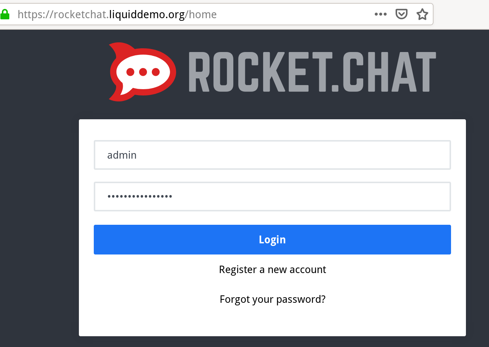
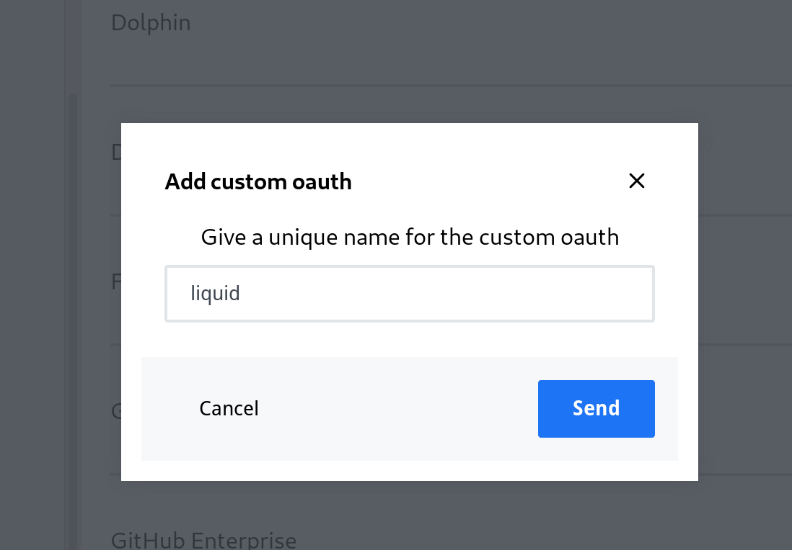
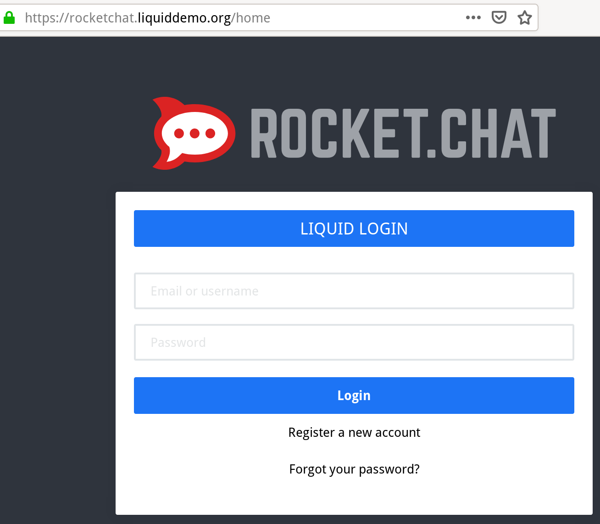
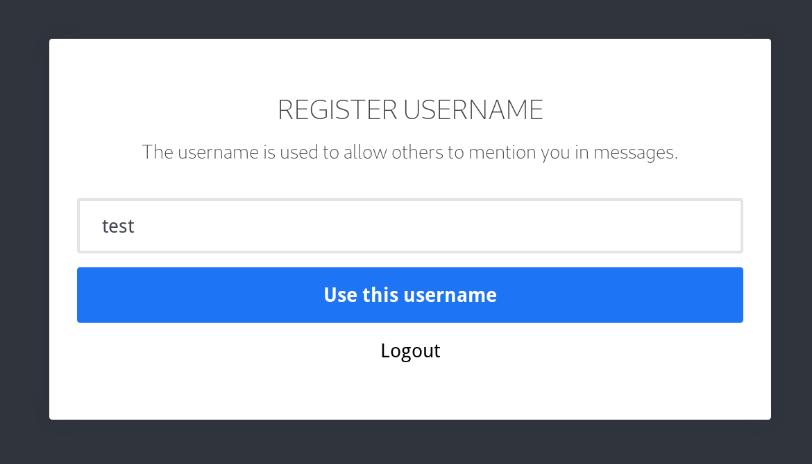

# RocketChat

RocketChat provides a chat service and is hosted at
`rocketchat.<liquid_domain>`. It requires manual configuration to let users log
in with accounts from `liquid-core`, see the steps below.


## Set up authentication

Rocket.Chat can directly authenticate users with the `liquid-core` oauth2
server. Most of the configuration is automated, but there is one manual step
that needs to be performed by an administrator through Rocket.Chat's web admin.

1. Get the Rocket.Chat admin credentials:
    ```shell
    ./liquid getsecret liquid/rocketchat/adminuser
    ```

2. Log into Rocket.Chat - `http(s)://rocketchat.<liquid_domain>` - using those
   credentials.

   

3. Go to admin, oauth

   
   

4. Create custom oauth application and call it `Liquid`

   

5. Log out. On the login page, a new button, "Liquid Login", should appear.
   Click on it and go through the `liquid-core` login process. It should
   redirect back to Rocket.Chat and authenticate.

   

6. On first login, you are presented with a question, to choose a username.
   It's currently not based on the liquid username, so please enter something
   that people will recognize.

   
   

7. After you verify that the login button works correctly, please edit
   `liquid.ini` and set the following setting: `[liquid]
   rocketchat_show_login_form = false`. This will only keep the login button,
   hiding the user/password form.
